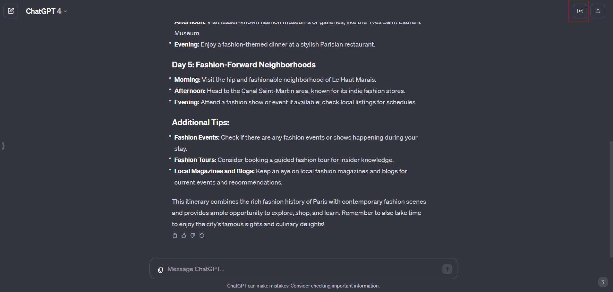
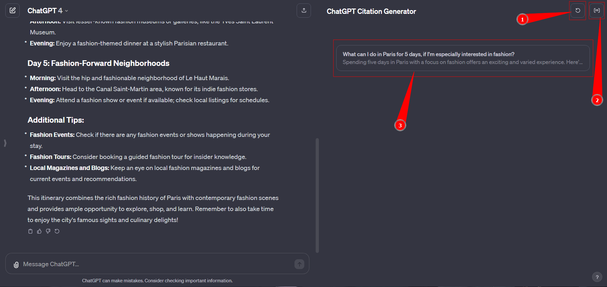

# ChatGPT Citations

## Overview
The ChatGPT Citations is a browser extension designed to generate BibTeX citations from chat conversations in OpenAI's ChatGPT interface. This tool aims to assist students, researchers, and anyone who needs to cite conversations or information obtained from ChatGPT in their academic or professional work.

## Features
- Extracts user prompts from ChatGPT chat sessions.
- Generates unique BibTeX entries for each prompt.
- Easy to use with a simple click-to-generate functionality.

## Installation
- [Chrome](https://chromewebstore.google.com/detail/chatgpt-citation-generato/jgojgjlkjbjllniaeomafkjmcbmofbid)
- [Firefox](https://addons.mozilla.org/en-US/firefox/addon/chatgpt-citation-generator/)

# Usage

To get started open ChatGPT and start a chat about some serious stuff, like in our example "What can I do in Paris for 5 days, if I'm especially interested in fashion?".

You'll notice a new button at the top right has appeared.



Once clicked a menu will open on the right with citations ready to copy:



1. Click to refresh citations as you chat

2. Click to close the menu

3. Click to copy the citation in bibtex format. In our case this will look like this:

   ```bibtex
   @online{What can_1703357315504_353695,
     author = {OpenAI gpt-4},
     title = {What can I do in Paris for 5 days, if I'm especially interested in fashion?},
     date = {2023-12-23},
     url = {https://chat.openai.com/c/02bdefd5-7d36-4413-a43e-179ee9050d10}
   }
   ```

**NOTE:** Currently the URL to the chat will only be available when logged in. Other users will not be able to see the chat. We *may* work on a feature to automatically export the chat and use the url of the exported chat instead in the future. If you don't want to wait, you're more than welcome to implement it yourself and issue a PR :)

## Contributing

Contributions to the project are welcome! If you have a bug to report or a feature to suggest, please open an issue in this repository.

## License
This project is licensed under the MIT License - see the [LICENSE](LICENSE) file for details.


---

*This README is a work in progress and will be updated as the project evolves
